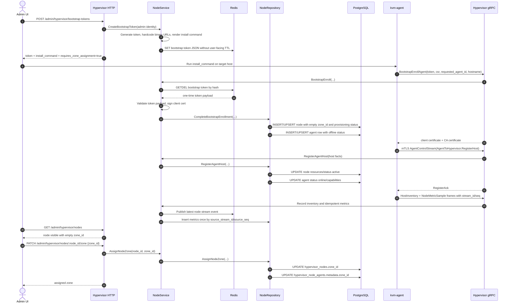

# Add Agent Vao Hypervisor Flow

## Muc Tieu

Flow nay de Admin UI them mot hypervisor agent moi ma khong day thong tin ky thuat tu FE xuong BE. Backend tu sinh bootstrap token, version, binary URL, install command va luu token tam thoi trong Redis. Sau khi agent cai xong va register thanh cong, Admin UI moi gan node do vao zone.

## Nguyen Tac

- Admin UI khong gui `zone_id`, binary URL, version, hostname prefix, cluster name hay node role khi tao bootstrap token.
- Request struct nam trong `internal/transport/http/dto/req`.
- Binary URL cua kvm-agent duoc hardcode trong `internal/service/node_service.go`.
- Bootstrap token luu Redis one-time, consume bang `GETDEL`, khong luu PostgreSQL, khong expose TTL.
- Entity khong import `encoding/json`, khong chua `json` tag; opaque metadata dung `[]byte`.
- Response JSON map truc tiep trong handler bang `gin.H`, khong dung response DTO file rieng.
- Handler chi bind/parse/log/map error/call service. Khong goi repository.
- Service xu ly business flow. Khong SQL, khong log, khong DTO.
- Repository la noi duy nhat co SQL va scan DB model.
- Domain phai co service interface va repository interface.

## Endpoint

| Buoc | Endpoint | Nhiem vu |
| --- | --- | --- |
| 1 | `POST /admin/hypervisor/bootstrap-tokens` | Tao token va install command, khong can request body |
| 2 | gRPC `BootstrapEnrollAgent` | Agent dung token de xin client certificate |
| 3 | gRPC `AgentControlStream` | Agent register host, heartbeat, inventory, metrics, command result |
| 4 | `GET /admin/hypervisor/nodes` | Admin UI thay node da len agent nhung chua gan zone |
| 5 | `PATCH /admin/hypervisor/nodes/:node_id/zone` | Admin UI gan node vao zone |
| 6 | `GET /admin/hypervisor/nodes/:node_id` | Admin UI xem detail node, storage, NIC, VPS read-only, events |
| 7 | `GET /admin/hypervisor/nodes/:node_id/stream` | Admin UI nhan live metrics/status bang WebSocket |

## Sequence



## Chi Tiet Flow

### 1. Tao Bootstrap Token

Admin UI goi `POST /admin/hypervisor/bootstrap-tokens` voi admin session cookie. Request body khong bat buoc va khong duoc dung de dieu khien binary/version/zone.

Backend:

- Sinh token dang `hvb_*`.
- Hash token de tao Redis key, khong luu plain token trong key.
- Luu token payload vao Redis de dung mot lan bang `GETDEL`.
- Khong nhan hay tra `ttl`, `hostname_prefix`, `cluster_name`, `node_role`.
- Dung hardcoded binary URL:
  - `https://github.com/phucle996/kvm-agent/releases/download/{version}/kvm-agent-linux-amd64.tar.gz`
  - `https://github.com/phucle996/kvm-agent/releases/download/{version}/kvm-agent-linux-arm64.tar.gz`
- Render install command tra ve cho Admin UI.

### 2. Agent Enroll

Sau khi admin chay install command tren host, agent goi gRPC `BootstrapEnrollAgent` bang bootstrap token va CSR.

Backend:

- Consume token bang Redis `GETDEL`; token mat ngay sau lan enroll dau tien.
- Ky client certificate cho `requested_agent_id`.
- Tao node tam thoi trong `hypervisor_nodes` voi:
  - `id = requested_agent_id`
  - `zone_id = ""`
  - `status = provisioning`
- Tao agent row trong `hypervisor_node_agents` voi status `offline`.

### 3. Agent Register Host, Inventory, Metrics

Agent mo mTLS stream va frame dau tien phai la `RegisterHost`. Service chi chap nhan khi `agent_id == host_id` de tranh gan nham node. Proto khong con field `zone`; zone chi do Admin UI gan sau.

Repository update:

- `hypervisor_nodes`: hostname, management IP, CPU, RAM, disk, status `active`.
- `hypervisor_node_agents`: version, hostname, capabilities, status `online`, heartbeat time.
- `hypervisor_storage_pools` va `hypervisor_network_interfaces`: upsert theo inventory cua agent.
- `hypervisor_node_metrics` va `vps_metrics`: insert idempotent theo `(source_stream_id, source_seq)`.

Agent frame wrapper co `stream_id` va `seq`. Khi app backend chay nhieu replica, reconnect vao replica nao cung khong duoc duplicate metric/command state vi DB unique index va command lease bao ve.

### 4. Metrics Stream Va Rollup

- Backend publish latest node event vao Redis Pub/Sub channel `hypervisor:node_stream:<node_id>` de WebSocket fanout.
- Metrics raw giu 15 ngay theo migration/batch policy; rollup tables da co bucket 60s va 300s de batch job ghi lich su chart.
- Admin UI dung `GET /admin/hypervisor/nodes/:node_id/metrics` de load fallback history va WebSocket de nhan live update.

### 5. Admin Gan Zone

Node sau khi register se hien tren Admin UI qua `GET /admin/hypervisor/nodes`. Luc nay `zone_id` rong, nen UI can hien trang thai chua gan zone va cho admin chon zone.

Admin UI goi:

```http
PATCH /admin/hypervisor/nodes/:node_id/zone
Content-Type: application/json

{
  "zone_id": "01K..."
}
```

Backend validate `node_id`, `zone_id`, update `hypervisor_nodes.zone_id` va merge `zone_id` vao `hypervisor_node_agents.metadata`.

## Layer Mapping

| Layer | File | Trach nhiem |
| --- | --- | --- |
| Domain entity | `internal/domain/entity/node.go` | Business structs, khong `encoding/json`, khong `json` tag |
| Domain repo interface | `internal/domain/repository/node_repository.go` | Persistence contract |
| Domain service interface | `internal/domain/service/node_service.go` | Business capability contract |
| Service | `internal/service/node_service.go` | Token, cert, enroll, register, assign zone |
| Repository | `internal/repository/node_repository.go` | SQL, transaction, model scan |
| HTTP handler | `internal/transport/http/handler/hypervisor_node_handler.go` | Parse request, call service, response |
| HTTP req DTO | `internal/transport/http/dto/req/node_hypervisor_req.go` | Request body structs |
| gRPC transport | `internal/transport/grpc/agentregistry/server.go` | Proto/entity mapping va gRPC error mapping |
| Admin UI | `adminui/src/pages/hypervisor/DetailHypervisor.tsx` | Detail page, metrics chart, WebSocket |

## Danh Gia Codebase Sau Khi Chinh

- Bootstrap token da chuyen sang Redis one-time token, khong con bang PostgreSQL va khong expose TTL.
- FE khong con day binary URL/version/zone xuong BE khi tao bootstrap token.
- Proto da doi sang `AgentToHypervisor` / `HypervisorToAgent`, bo `zone`, them inventory/metrics/command result.
- KVM agent da bo `controlplane` module/env va dung `registry` stream toi hypervisor.
- Detail page hypervisor da co live metrics WebSocket, storage, NIC, VPS read-only.
- Da them domain service/repository interface de handler va service khong phu thuoc concrete implementation.
- JSON response duoc map inline bang `gin.H` trong handler; entity khong con `encoding/json` hay `json` tag.
- Da them endpoint gan zone sau khi agent register.
- Repository van con vai helper nho cho SQL filter/normalize JSON; co the tach tiep khi mo rong test, nhung khong nen refactor lon neu chua can.
- Schema hien tai van de `zone_id NOT NULL`, nen pending zone dang duoc bieu dien bang chuoi rong de tranh migration pha du lieu.
