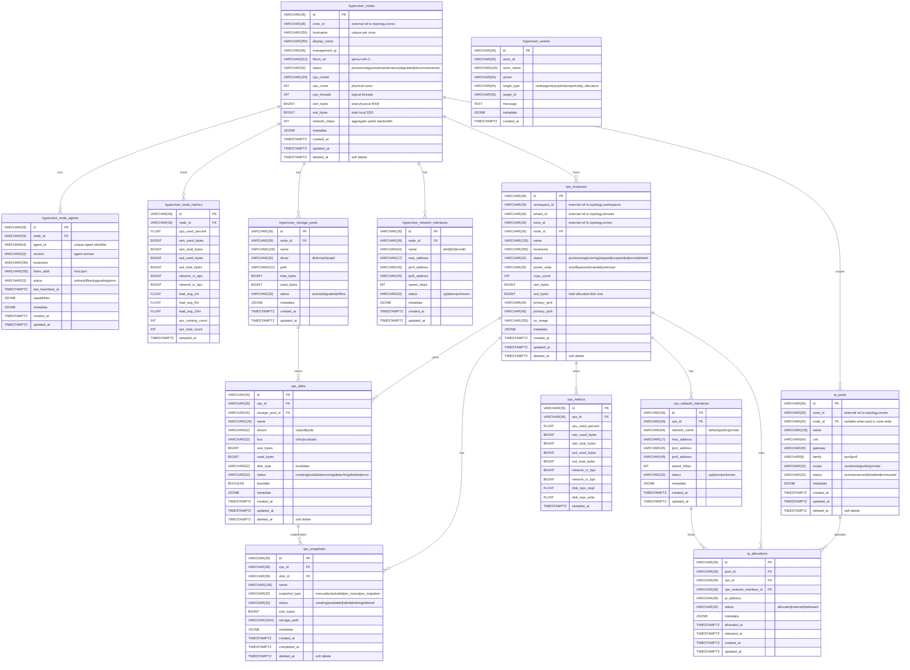

# Hypervisor ERD

## Purpose

Production-ready database schema design for the `hypervisor` service. This service manages KVM compute nodes, node agents, VPS instances, VPS disks, snapshots, IP allocations, event/audit records, and runtime metrics for CPU, RAM, SSD, and network.

## Scope

**In scope:**
- KVM node registration and lifecycle.
- Node agent heartbeat and capability tracking.
- VPS instance allocation and runtime state.
- VPS disks, disk placement, and snapshot lifecycle.
- Hypervisor-local IP pools and IP allocations for VPS networking v1.
- Resource metrics for both nodes and VPS using stream-only metric tables.
- Storage pool and network interface inventory on nodes.
- VPS network interface mapping.
- Hypervisor events for admin audit and recent activity.

**Out of scope:**
- Billing, invoicing, payment.
- VPS plans, packages, pricing, quotas.
- Tenant/workspace/zone management (owned by `topology-manager`; only external reference IDs are stored here).

## ERD



## Table Design Notes

### `hypervisor_nodes`
- Represents a physical KVM host machine.
- `zone_id` is an external reference to `topology-manager.zones`, not a FK in this DB.
- `status` lifecycle: `provisioning → active ↔ maintenance ↔ degraded → decommissioned`.
- `deleted_at` enables soft delete; decommissioned nodes should not be hard-deleted.

### `hypervisor_node_agents`
- One node normally runs one active agent, but the table supports agent rotation during upgrades or replacement.
- `last_heartbeat_at` is updated by agent ping; stale heartbeat means the agent is operationally offline.
- `capabilities` stores feature flags such as `live_migration`, `snapshot`, `resize_disk`, or `gpu_passthrough`.

### `hypervisor_node_metrics`
- **Single table, stream-only.** No separate current metric table.
- Agent streams samples periodically (for example every 30s–60s).
- Latest metric is retrieved with `ORDER BY sampled_at DESC LIMIT 1`.
- `vps_running_count` and `vps_total_count` are denormalized counters snapshotted by the agent for fast dashboard reads.

### `hypervisor_storage_pools`
- Represents libvirt storage pools on the node: local dir, LVM, ZFS, or Ceph RBD.
- Provides placement target for `vps_disks` and aggregate storage usage for node detail pages.

### `hypervisor_network_interfaces`
- Physical, bridge, bond, or VLAN interfaces on the node.
- Used for node topology visibility and network capacity monitoring.

### `vps_instances`
- Represents a customer VPS/VM.
- `workspace_id`, `tenant_id`, and `zone_id` are external references only — no cross-DB joins.
- `node_id` references the hosting KVM node.
- `ssd_bytes` is total disk allocation for fast filtering/summary; detailed disk layout is owned by `vps_disks`.
- `power_state` is the real libvirt domain state observed by the agent.

### `vps_disks`
- Represents one disk attached to a VPS: boot disk or data disk.
- Enables production flows such as attach disk, detach disk, resize disk, and disk-level snapshot.
- `storage_pool_id` defines the physical/logical storage pool where the disk is stored.
- `device` tracks guest-visible mapping such as `vda` or `vdb`.

### `vps_snapshots`
- Represents a point-in-time snapshot for a VPS or a specific disk.
- `disk_id` supports disk-level snapshot; `vps_id` supports listing snapshots from the VPS detail page.
- `snapshot_type` distinguishes manual snapshots from operational snapshots such as `pre_resize` and `pre_migration`.
- Snapshot retention/billing policy is intentionally outside this ERD.

### `vps_metrics`
- **Single table, stream-only.** Same pattern as node metrics.
- Agent collects per-VM stats from libvirt (`virDomainGetStats`) and streams samples.
- Latest metric is retrieved with `ORDER BY sampled_at DESC LIMIT 1`.
- `disk_iops_read` and `disk_iops_write` support SSD performance visibility.

### `vps_network_interfaces`
- Virtual NICs attached to a VPS.
- Maps to libvirt interface definitions.
- `network_name` identifies the libvirt network or bridge the NIC is attached to.

### `ip_pools`
- Hypervisor-local IP pool ownership for v1 VPS networking.
- A pool can be zone-wide (`node_id` null) or node-scoped (`node_id` set).
- If a dedicated network service becomes owner later, this table can become a cached/external allocation reference.

### `ip_allocations`
- Tracks IP addresses allocated/reserved/released from `ip_pools`.
- Binds each active IP to a VPS and optionally a specific VPS network interface.
- Active IP uniqueness is enforced by unique partial index on `ip_address WHERE released_at IS NULL`.

### `hypervisor_events`
- Audit/recent-activity table for hypervisor operations.
- Uses polymorphic `target_type + target_id` instead of hard FK to every possible resource table.
- Covers node, agent, VPS, disk, snapshot, and IP allocation lifecycle events.
- Does not replace metric streams.

## Metric Strategy

| Concern | Approach |
| --- | --- |
| Real-time latest | Query the single metric table with `ORDER BY sampled_at DESC LIMIT 1` |
| Dashboard charts | Query time-range windows with `WHERE sampled_at BETWEEN $1 AND $2` |
| Retention | Future job can delete or archive samples older than the retention window |
| High-volume scaling | Future range partitioning by `sampled_at` |
| External TSDB | Future Prometheus/VictoriaMetrics export can be added without changing core resource ERD |

## Production Indexes

```sql
-- hypervisor_nodes
CREATE INDEX idx_nodes_zone_status ON hypervisor_nodes (zone_id, status) WHERE deleted_at IS NULL;

-- hypervisor_node_agents
CREATE INDEX idx_agents_node ON hypervisor_node_agents (node_id, status);
CREATE INDEX idx_agents_heartbeat ON hypervisor_node_agents (last_heartbeat_at);

-- hypervisor_node_metrics
CREATE INDEX idx_node_metrics_lookup ON hypervisor_node_metrics (node_id, sampled_at DESC);

-- hypervisor_storage_pools
CREATE INDEX idx_storage_pools_node ON hypervisor_storage_pools (node_id);

-- hypervisor_network_interfaces
CREATE INDEX idx_net_ifaces_node ON hypervisor_network_interfaces (node_id);

-- vps_instances
CREATE INDEX idx_vps_node ON vps_instances (node_id, status) WHERE deleted_at IS NULL;
CREATE INDEX idx_vps_workspace ON vps_instances (workspace_id, status) WHERE deleted_at IS NULL;
CREATE INDEX idx_vps_tenant ON vps_instances (tenant_id) WHERE deleted_at IS NULL;
CREATE INDEX idx_vps_zone ON vps_instances (zone_id, status) WHERE deleted_at IS NULL;

-- vps_disks
CREATE INDEX idx_vps_disks_vps ON vps_disks (vps_id, status) WHERE deleted_at IS NULL;
CREATE INDEX idx_vps_disks_pool ON vps_disks (storage_pool_id) WHERE deleted_at IS NULL;

-- vps_snapshots
CREATE INDEX idx_vps_snapshots_vps ON vps_snapshots (vps_id, created_at DESC) WHERE deleted_at IS NULL;
CREATE INDEX idx_vps_snapshots_disk ON vps_snapshots (disk_id, created_at DESC) WHERE deleted_at IS NULL;

-- vps_metrics
CREATE INDEX idx_vps_metrics_lookup ON vps_metrics (vps_id, sampled_at DESC);

-- vps_network_interfaces
CREATE INDEX idx_vps_net_ifaces ON vps_network_interfaces (vps_id);

-- ip_pools
CREATE UNIQUE INDEX idx_ip_pools_zone_cidr ON ip_pools (zone_id, cidr) WHERE deleted_at IS NULL;
CREATE INDEX idx_ip_pools_zone_status ON ip_pools (zone_id, status) WHERE deleted_at IS NULL;
CREATE INDEX idx_ip_pools_node ON ip_pools (node_id) WHERE deleted_at IS NULL;

-- ip_allocations
CREATE UNIQUE INDEX idx_ip_allocations_active_ip ON ip_allocations (ip_address) WHERE released_at IS NULL;
CREATE INDEX idx_ip_allocations_pool_status ON ip_allocations (pool_id, status);
CREATE INDEX idx_ip_allocations_vps ON ip_allocations (vps_id);

-- hypervisor_events
CREATE INDEX idx_hypervisor_events_target ON hypervisor_events (target_type, target_id, created_at DESC);
CREATE INDEX idx_hypervisor_events_action ON hypervisor_events (action, created_at DESC);
```

## API / UI Usage

| Use Case | Data Source |
| --- | --- |
| Admin: Node list with health | `hypervisor_nodes` + latest `hypervisor_node_metrics` + `hypervisor_node_agents.status` |
| Admin: Node detail | Node tables + storage pools + network interfaces + hosted VPS count |
| Admin: Node metric chart | `hypervisor_node_metrics` time-range query |
| Admin: Storage pool usage | `hypervisor_storage_pools` + aggregate `vps_disks` by `storage_pool_id` |
| Customer: VPS list | `vps_instances` filtered by `workspace_id` |
| Customer: VPS detail | `vps_instances` + `vps_disks` + `vps_network_interfaces` + latest `vps_metrics` |
| Customer: VPS metric chart | `vps_metrics` time-range query |
| Customer: VPS snapshots | `vps_snapshots` filtered by `vps_id` |
| Customer: VPS IPs | `ip_allocations` + `vps_network_interfaces` |
| Dashboard KPI cards | Aggregate queries on nodes, VPS instances, disks, pools, IP allocations, latest metrics |
| Recent activity | `hypervisor_events` filtered by `target_type + target_id` |
| Zone detail (topology-manager) | RPC call to hypervisor to count nodes/VPS and aggregate zone-level metrics |

## Assumptions

- This document is **design-only**; no migration or code is generated.
- `hypervisor/migrations/000001_hypervisor_schema.up.sql` is currently empty and will be implemented based on this ERD.
- All IDs use ULID (26-char, sortable, no collision).
- `TIMESTAMPTZ` is used for all timestamps and stored in UTC.
- Metric tables use a single-table stream pattern — **no separate current snapshot table**.
- No billing, pricing, VPS plan, package, quota, invoice, or payment tables belong in this ERD.
- Hypervisor owns IP pool/allocation tables for v1 VPS networking; this can become an external network-service integration later.
- External references (`zone_id`, `workspace_id`, `tenant_id`) are **not** foreign keys in this DB; they reference IDs owned by `topology-manager` and are resolved via RPC/API when needed.
