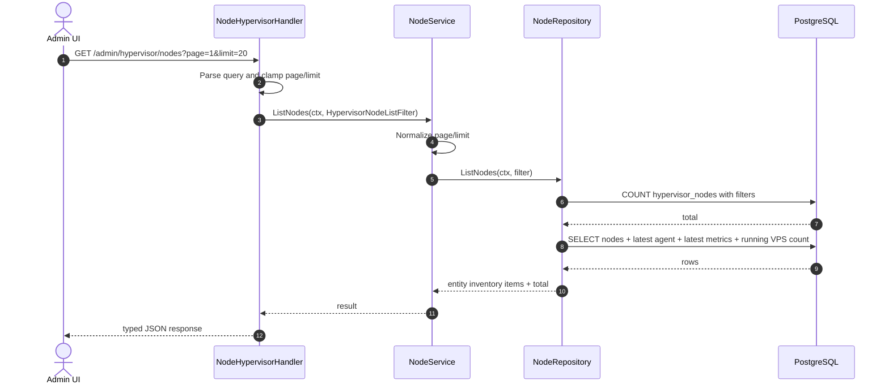

# List KVM Hypervisor Nodes Flow

## Purpose

`GET /admin/hypervisor/nodes` tra ve danh sach node da enroll/register, kem agent status moi nhat va utilization snapshot. Node co `zone_id = ""` la node da len agent nhung chua duoc Admin UI gan zone.

## Endpoint

| Field | Value |
| --- | --- |
| Method | `GET` |
| Path | `/admin/hypervisor/nodes` |
| Auth | IAM admin session cookies |
| Rate limit | `120 req/min` via key `hypervisor_admin_node_list` |
| Success response | `200 { "message": "ok", "data": { "items": [...], "page": 1, "limit": 20, "total": N } }` |

## Query Parameters

| Param | Type | Default | Description |
| --- | --- | --- | --- |
| `zone_id` | string | none | Filter nodes by zone. Empty zone means pending assignment. |
| `status` | string | none | Filter by node status: `provisioning`, `active`, `maintenance`, `degraded`, `decommissioned`. |
| `search` | string | none | Search hostname, display name, or management IP. |
| `page` | int | 1 | Page number, 1-based. Invalid values fallback to 1. |
| `limit` | int | 20 | Items per page, max 100. Invalid values fallback to 20. |

## Response Shape

```json
{
  "message": "ok",
  "data": {
    "items": [
      {
        "id": "01KQNODE...",
        "zone_id": "",
        "hostname": "hv-hcm-01",
        "display_name": "hv-hcm-01",
        "status": "active",
        "management_ip": "10.10.1.21",
        "cpu_cores": 8,
        "ram_gib": 128,
        "ssd_gib": 1024,
        "running_vps": 24,
        "agent_id": "01KQNODE...",
        "agent_version": "v0.1.0",
        "agent_status": "online",
        "last_heartbeat_at": "2026-04-27T12:00:00Z",
        "vcpu_usage_percent": 62.5,
        "memory_usage_percent": 71.2,
        "storage_usage_percent": 48.0
      }
    ],
    "page": 1,
    "limit": 20,
    "total": 48
  }
}
```

## Sequence



## Layer Detail

| Layer | File | Responsibility |
| --- | --- | --- |
| Handler | `internal/transport/http/handler/hypervisor_node_handler.go` | Parse query, call service, log/map errors, map response with `gin.H` |
| Service interface | `internal/domain/service/node_service.go` | `ListNodes` business contract |
| Service implementation | `internal/service/node_service.go` | Clamp list pagination and call repo |
| Repo interface | `internal/domain/repository/node_repository.go` | Persistence contract |
| Repo implementation | `internal/repository/node_repository.go` | SQL count/list and model scan |

## Repository Query Notes

- Count query filters `hypervisor_nodes n` with `n.deleted_at IS NULL`.
- List query joins latest agent with `LEFT JOIN LATERAL`.
- Latest node metrics use `DISTINCT ON (node_id)` ordered by `sampled_at DESC`.
- Running VPS count is grouped from `vps_instances` where status is `running`.
- Repository scans node/agent columns into existing model structs and aggregate columns into local values, then maps to entity.

## Error Mapping

| Condition | HTTP |
| --- | --- |
| IAM session invalid | `401` from middleware |
| Client IP denied | `403` from middleware |
| Rate limit exceeded | `429` from middleware |
| Repo/service failure | `503 service unavailable` |

## Admin UI Notes

- Use empty `zone_id` as "pending zone assignment".
- After the agent registers, Admin UI should call `PATCH /admin/hypervisor/nodes/:node_id/zone`.
- See `docs/add-agent-flow.md` for the full add-agent lifecycle.
